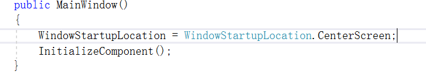
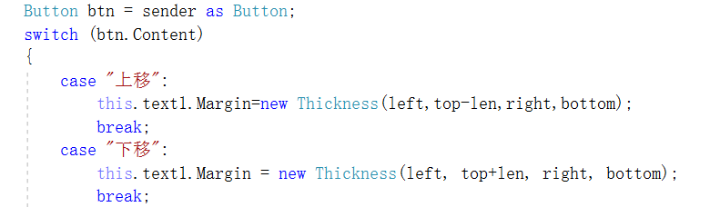
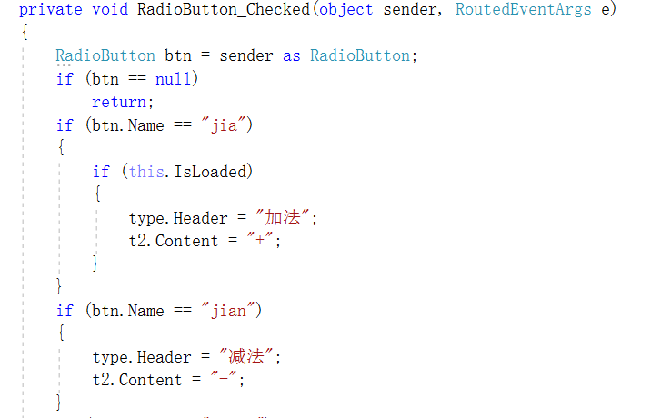
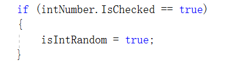
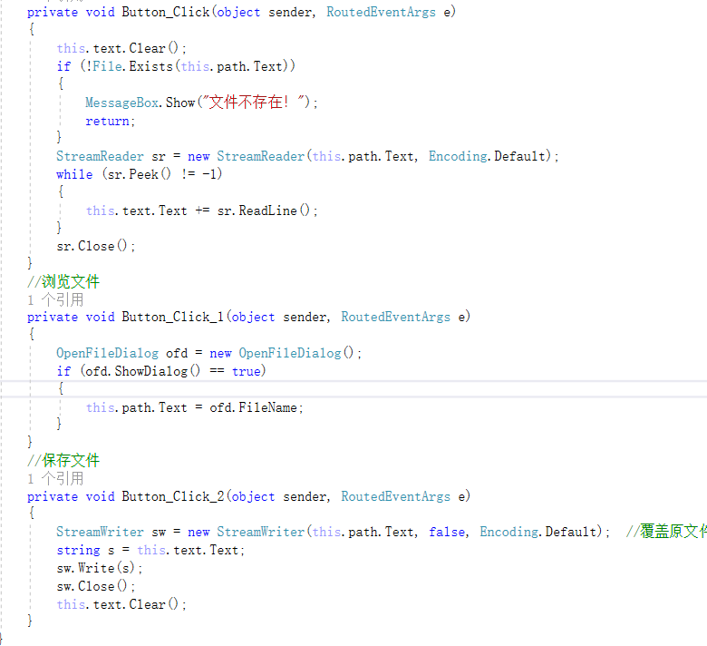

1.让窗口居中

2.更改背景色

this.txtAccount.Background = new SolidColorBrush(Color.FromArgb(255, 221, 221, 221));

改变字体颜色

text2.Foreground= new SolidColorBrush(Color.FromArgb(255, color[0], color[1], color[2]));

3.多个button定义同一个click事件

4.多个radiobutton定义同一个选中事件

5.判断单选框是否选中

6.listbox添加一行

listBox1.Items.Add(v.Print());

7.文件操作

8.显示新窗口

P166

9.关闭全部窗口

App.Current.Shutdown();

10.外边距

 this.text1.Margin=new Thickness(left,top-len,right,bottom);            